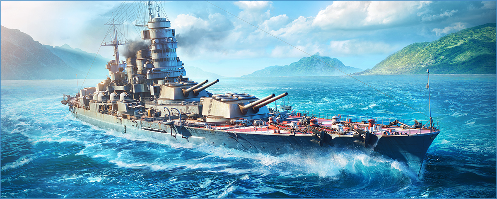
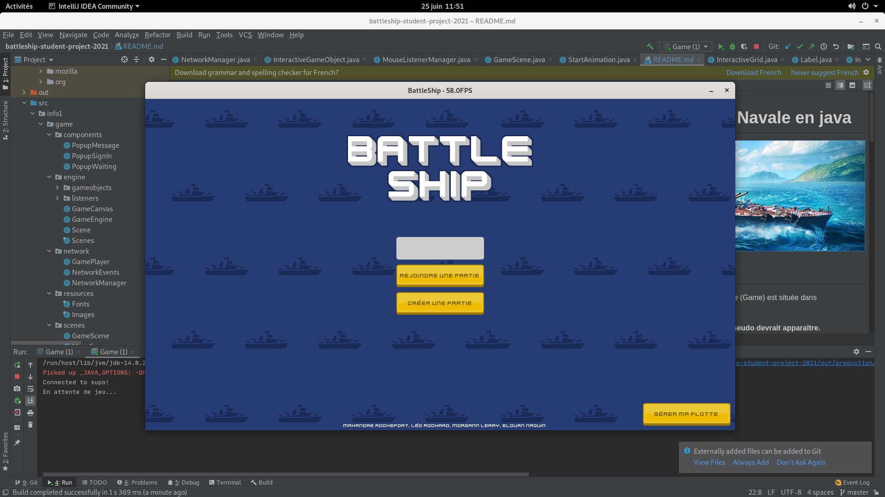

# Projet S2 : Bataille Navale en java

## Lancer le code

La classe principale pour lancer le programme (Game) est située dans info1/game/Game.
 

**Une fenêtre avec une demande de votre pseudo devrait apparaître.**

### Entrez votre pseudo

Votre pseudo peut contenir au maximum 20 caractères (vous avez la liberté de prendre des caractères spéciaux).

###Menu

Vous devriez arriver sur la fenêtre ci-dessous :

###Disposition de votre flotte

Votre flotte est modulable à l'aide du bouton "Gerer ma flotte" en bas à droite.
Vous pouvez choisir la composition France ou Belgique. Elle est de base réglée sur France.

L'aide est situé sur la gauche de l'écran.

Validez votre disposition en bas à droite sur le bouton "Valider".

###Créer et rejoindre une partie

Lorsque vous cliquez sur créer une partie, une popup d'attente d'affiche.
Vous entrerez en jeu lorsqu'un joueur aura rejoint cette partie.

Pour rejoindre une partie créee par votre ami(e), marquez dans le champ de texte au dessus le numéro de partie et la rejoindre.
Attention à ne pas avoir le même pseudo que votre ami !

Si vous avez un problème de proxy, allez dans la catégorie `Aide`.

###Jouer

A gauche se trouve votre grille de bateau, à droite la grille de votre ennemi.

Le premier à jouer sera toujours le créateur de la partie ! 

Ensuite, lorsque vous cliquez sur une case, en bas de la grille adverse vous avez l'information si vous avez touché, coulé etc...
Vous pouvez également savoir si vous avez touché ou raté à l'aide des symboles :) .

Le bouton annuler en bas à gauche permet de quitter la partie.

##Aide

###Vous avez une erreur lors de la création de la partie ou de la création de votre pseudo

C'est dû au proxy. Si vous êtes à l'IUT, allez dans info1/game/Game, et activer le proxy (true).

##Explication des packages
###game
Il contient tout notre travail effectué, dont la classe principale

###engine

Il contient notre moteur de jeu, GameEngine.

C'est lui qui permet de dessiner à l'écran, de limiter les FPS, de diriger les scènes etc...

Nos scenes sont contenues dans la classe enum Scenes, et chaque scène hérite de la classe Scene. 

###components

contient les popups

###gameobjects

Il contient tout les objets interactifs sur la scene.

###listeners
C'est là où on ajoute les listeners aux gameobjects

###network
Gestion du serveur

###resources
Ici nous gérons nos fonts et nos Images. Cela permet de les charger une fois et de les réutiliser après.

###scenes
Contient la classe Menu, Game et Setup(gestion des bateaux).

###utils
Permet de setup des positions avec des vecteurs
